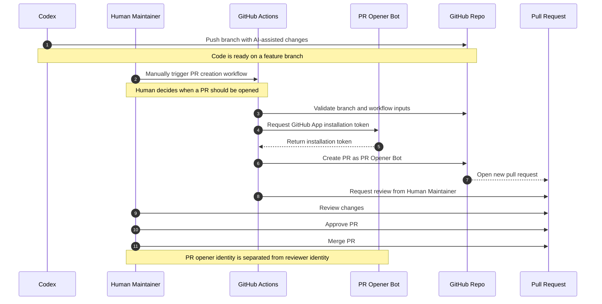

# GitHub App PR Operator Guide

This guide is for the human operator who wants to open a pull request through the `PR Opener Bot` workflow after Codex has already prepared a branch.

## Why This Flow Exists

This flow is designed for an AI-assisted solo developer workflow.

The pain point is simple:

- AI can help produce the code
- the human still needs to review and merge responsibly
- if the human personal account opens the PR directly, that same identity cannot meaningfully serve as the approval path

`PR Opener Bot` solves that by taking the PR opener role, while the human account stays in the reviewer and approver role.

## Workflow Diagram



## Before You Start

Make sure:

- the branch has already been pushed to GitHub
- the workflow and secrets have already been set up
- the PR title and body are ready
- you know whether the PR should open as draft or ready for review

## Expected Flow

1. Codex works locally and commits as `Codex <codex@openai.com>`.
2. The branch is pushed to GitHub.
3. A human opens the GitHub Actions workflow manually.
4. The workflow creates the PR through `PR Opener Bot`.
5. The workflow requests review from `teohsinyee`.
6. `teohsinyee` reviews and decides whether to merge.

## Inputs You Need

Prepare these values before triggering the workflow:

- `branch`: the source branch to open the PR from
- `base`: the target branch, usually `main`
- `title`: the PR title
- `body`: the PR description
- `draft`: whether the PR should start as draft

## Recommended Title Style

Use a title that clearly states the change scope.

Examples:

- `docs: add GitHub App PR setup runbook`
- `ci: add manual PR creation workflow via GitHub App`
- `docs: document GitHub App PR operator flow`

## Recommended Body Structure

Use a short body that helps the reviewer decide quickly:

```md
## Summary
- what changed
- why it changed

## Validation
- what was tested
- what still needs manual verification

## Notes
- any setup dependencies or reviewer context
```

## How To Trigger The Workflow

1. Open the repository on GitHub.
2. Go to the `Actions` tab.
3. Open the PR creation workflow.
4. Select `Run workflow`.
5. Fill in `branch`, `base`, `title`, `body`, and `draft`.
6. Start the run.

## What Success Looks Like

The run is successful when:

- the workflow finishes without error
- a pull request is created from the intended branch
- the PR opener is `PR Opener Bot`, not the reviewer personal identity
- review is requested from `teohsinyee`

## What To Check On The PR

After creation, verify:

- the head branch is correct
- the base branch is correct
- the title is correct
- the body rendered as expected
- the PR is draft or ready, as intended
- `teohsinyee` appears in requested reviewers

## Common Failure Cases

### Branch Not Found

Possible causes:

- the branch was not pushed
- the branch name was typed incorrectly
- the workflow is validating against remote branches and the push has not completed

What to do:

- confirm the exact branch name
- confirm the branch exists on GitHub
- rerun the workflow with the correct branch

### Missing Or Broken Secrets

Possible causes:

- `PR_APP_ID` is missing
- `PR_APP_PRIVATE_KEY` is missing
- the private key formatting is broken

What to do:

- verify the repository secrets exist
- re-paste the private key with correct line breaks
- rerun after saving

### App Installed On The Wrong Scope

Possible causes:

- the App is installed on a different repo
- the installation owner is wrong
- the workflow is using the wrong installation

What to do:

- review the GitHub App installation page
- confirm this repo is included
- confirm the workflow is targeting the intended installation

### Duplicate PR

Possible causes:

- a PR for the branch is already open
- the workflow was rerun without checking the existing PR list

What to do:

- search open PRs for the same branch
- reuse the existing PR if it is still the correct one
- close the old PR first only if that is the intended workflow

### Review Request Not Added

Possible causes:

- the PR was created but reviewer request failed
- the App permissions are incomplete
- the request payload is wrong

What to do:

- open the workflow logs
- confirm whether PR creation succeeded first
- add the review request manually if needed
- record the failure in the change logs file for follow-up

## Operator Rules

- Do not use this workflow as a general repo write path
- Keep the workflow manually triggered by a human
- Keep human review required before merge
- Prefer clear titles and bodies so review stays lightweight
- Record surprising failures so the next run is easier

## After Each Real Run

- check the final PR state
- note any mismatch between planned and real behavior
- update `docs/changes/2026-06-06-github-app-pr-automation.logs.md` when something worth keeping happens
